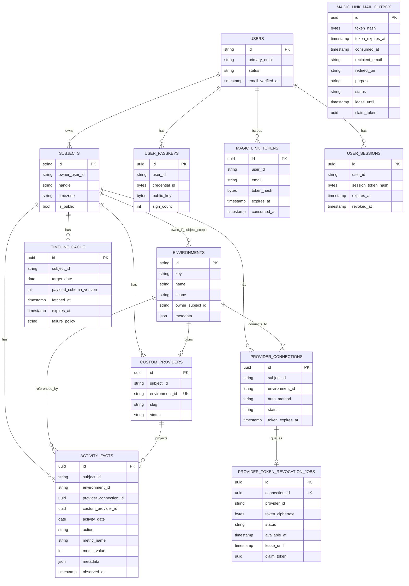

# ERD 문서 (개념 + 물리 기준)

최종 갱신일: 2026-08-13

이 문서의 SQL은 핵심 관계를 설명하는 축약본입니다. 실제 적용 schema와 제약의 단일 진실 원천은 `db/migrations/0001_init.sql`부터 순서대로 적용한 결과입니다. Phase 2/3의 settings, custom activity/idempotency, key ID, audit, retention 구조는 `0002_provider_operations.sql`과 `0003_roadmap_operations.sql`에, distributed rate-limit bucket은 `0004_distributed_rate_limits.sql`에, durable encrypted provider revoke queue는 `0005_provider_token_revocations.sql`에 정의돼 있습니다.

## 1. 개념 ERD

도메인 관계를 먼저 고정하기 위한 ERD입니다. 인증(User/Auth) 관계까지 포함합니다.



해석 포인트:

- `User`는 인증 주체입니다.
- `Subject`는 활동/렌더링 주체입니다(대부분 사용자 계정과 연결되지만 개념적으로 분리).
- `Environment`는 독립 엔터티이며, `ActivityFact.environment_id`로 join됩니다.
- `Environment.scope=global`이면 `owner_subject_id`는 비어야 하고,
  `scope=subject`이면 `owner_subject_id`가 필수입니다.
- `ProviderConnection`은 subject별 외부 인증 상태(OAuth/token)를 나타냅니다.

## 2. 물리 ERD (CockroachDB 핵심 축약본)

CockroachDB 물리 모델의 핵심 관계를 설명합니다. 이 코드 블록을 migration 대신 실행하지 않습니다.

```sql
-- users
CREATE TABLE users (
  id STRING PRIMARY KEY,
  primary_email STRING NOT NULL UNIQUE,
  email_verified_at TIMESTAMPTZ NULL,
  status STRING NOT NULL DEFAULT 'active',
  created_at TIMESTAMPTZ NOT NULL DEFAULT now(),
  updated_at TIMESTAMPTZ NOT NULL DEFAULT now(),
  CONSTRAINT users_status_chk CHECK (status IN ('active', 'disabled', 'pending'))
);

-- subjects
CREATE TABLE subjects (
  id STRING PRIMARY KEY,
  owner_user_id STRING NULL REFERENCES users(id) ON DELETE SET NULL,
  handle STRING NOT NULL UNIQUE,
  display_name STRING NULL,
  timezone STRING NOT NULL,
  is_public BOOL NOT NULL DEFAULT true,
  created_at TIMESTAMPTZ NOT NULL DEFAULT now(),
  updated_at TIMESTAMPTZ NOT NULL DEFAULT now()
);

CREATE INDEX subjects_owner_user_idx
  ON subjects (owner_user_id);

-- user_passkeys
CREATE TABLE user_passkeys (
  id UUID PRIMARY KEY DEFAULT gen_random_uuid(),
  user_id STRING NOT NULL REFERENCES users(id) ON DELETE CASCADE,
  credential_id BYTES NOT NULL UNIQUE,
  public_key BYTES NOT NULL,
  aaguid BYTES NULL,
  sign_count INT8 NOT NULL DEFAULT 0,
  transports STRING[] NULL,
  label STRING NULL,
  created_at TIMESTAMPTZ NOT NULL DEFAULT now(),
  last_used_at TIMESTAMPTZ NULL
);

CREATE INDEX user_passkeys_user_idx
  ON user_passkeys (user_id);

-- magic_link_tokens
CREATE TABLE magic_link_tokens (
  id UUID PRIMARY KEY DEFAULT gen_random_uuid(),
  user_id STRING NULL REFERENCES users(id) ON DELETE CASCADE,
  email STRING NOT NULL,
  token_hash BYTES NOT NULL UNIQUE,
  purpose STRING NOT NULL DEFAULT 'signin',
  expires_at TIMESTAMPTZ NOT NULL,
  consumed_at TIMESTAMPTZ NULL,
  created_at TIMESTAMPTZ NOT NULL DEFAULT now(),
  CONSTRAINT magic_link_tokens_purpose_chk CHECK (purpose IN ('signin', 'verify_email'))
);

CREATE INDEX magic_link_tokens_email_idx
  ON magic_link_tokens (email, created_at DESC);

-- magic_link_mail_outbox (delivery intent; no raw/decryptable token or user FK)
CREATE TABLE magic_link_mail_outbox (
  id UUID PRIMARY KEY DEFAULT gen_random_uuid(),
  token_hash BYTES NULL,
  token_expires_at TIMESTAMPTZ NULL,
  consumed_at TIMESTAMPTZ NULL,
  recipient_email STRING NOT NULL,
  redirect_uri STRING NOT NULL DEFAULT '',
  purpose STRING NOT NULL DEFAULT 'signin',
  status STRING NOT NULL DEFAULT 'pending',
  attempts INT8 NOT NULL DEFAULT 0,
  available_at TIMESTAMPTZ NOT NULL DEFAULT now(),
  lease_until TIMESTAMPTZ NULL,
  claim_token UUID NULL,
  created_at TIMESTAMPTZ NOT NULL DEFAULT now(),
  updated_at TIMESTAMPTZ NOT NULL DEFAULT now(),
  terminal_at TIMESTAMPTZ NULL,
  terminal_reason STRING NULL
);

-- user_sessions
CREATE TABLE user_sessions (
  id UUID PRIMARY KEY DEFAULT gen_random_uuid(),
  user_id STRING NOT NULL REFERENCES users(id) ON DELETE CASCADE,
  session_token_hash BYTES NOT NULL UNIQUE,
  created_at TIMESTAMPTZ NOT NULL DEFAULT now(),
  expires_at TIMESTAMPTZ NOT NULL,
  revoked_at TIMESTAMPTZ NULL,
  last_seen_at TIMESTAMPTZ NULL,
  ip INET NULL,
  user_agent STRING NULL
);

CREATE INDEX user_sessions_user_idx
  ON user_sessions (user_id, expires_at DESC);

-- environments
CREATE TABLE environments (
  id STRING PRIMARY KEY,
  key STRING NOT NULL,
  name STRING NOT NULL,
  scope STRING NOT NULL,
  owner_subject_id STRING NULL REFERENCES subjects(id) ON DELETE CASCADE,
  metadata JSONB NOT NULL DEFAULT '{}'::JSONB,
  created_at TIMESTAMPTZ NOT NULL DEFAULT now(),
  updated_at TIMESTAMPTZ NOT NULL DEFAULT now(),
  CONSTRAINT environments_scope_chk CHECK (scope IN ('global', 'subject')),
  CONSTRAINT environments_owner_subject_chk CHECK (
    (scope = 'global' AND owner_subject_id IS NULL)
    OR
    (scope = 'subject' AND owner_subject_id IS NOT NULL)
  )
);

CREATE UNIQUE INDEX environments_owner_key_uq
  ON environments (COALESCE(owner_subject_id, ''), key);

-- provider_connections (외부 provider 인증 상태)
CREATE TABLE provider_connections (
  id UUID PRIMARY KEY DEFAULT gen_random_uuid(),
  subject_id STRING NOT NULL REFERENCES subjects(id) ON DELETE CASCADE,
  environment_id STRING NOT NULL REFERENCES environments(id) ON DELETE CASCADE,
  auth_method STRING NOT NULL,
  external_account_id STRING NULL,
  status STRING NOT NULL DEFAULT 'active',
  scopes STRING[] NULL,
  access_token_ciphertext BYTES NULL,
  refresh_token_ciphertext BYTES NULL,
  token_expires_at TIMESTAMPTZ NULL,
  last_synced_at TIMESTAMPTZ NULL,
  last_error STRING NULL,
  created_at TIMESTAMPTZ NOT NULL DEFAULT now(),
  updated_at TIMESTAMPTZ NOT NULL DEFAULT now(),
  CONSTRAINT provider_connections_auth_method_chk CHECK (auth_method IN ('oauth2', 'token', 'none')),
  CONSTRAINT provider_connections_status_chk CHECK (status IN ('active', 'revoked', 'error'))
);

CREATE UNIQUE INDEX provider_connections_subject_env_account_uq
  ON provider_connections (subject_id, environment_id, COALESCE(external_account_id, ''));

-- provider_token_revocation_jobs (worker-only encrypted remote revoke queue)
CREATE TABLE provider_token_revocation_jobs (
  id UUID PRIMARY KEY DEFAULT gen_random_uuid(),
  connection_id UUID NULL UNIQUE REFERENCES provider_connections(id) ON DELETE SET NULL,
  provider_id STRING NOT NULL,
  token_ciphertext BYTES NOT NULL,
  token_key_id STRING NULL,
  status STRING NOT NULL DEFAULT 'pending',
  attempts INT8 NOT NULL DEFAULT 0,
  available_at TIMESTAMPTZ NOT NULL DEFAULT now(),
  lease_until TIMESTAMPTZ NULL,
  claim_token UUID NULL,
  terminal_at TIMESTAMPTZ NULL,
  terminal_reason STRING NULL,
  created_at TIMESTAMPTZ NOT NULL DEFAULT now(),
  updated_at TIMESTAMPTZ NOT NULL DEFAULT now(),
  CONSTRAINT provider_token_revocation_jobs_status_chk CHECK (
    status IN ('pending', 'processing', 'dead')
  ),
  CONSTRAINT provider_token_revocation_jobs_terminal_reason_chk CHECK (
    terminal_reason IS NULL OR terminal_reason IN ('max_attempts_exhausted')
  ),
  CONSTRAINT provider_token_revocation_jobs_lease_chk CHECK (
    (status = 'pending' AND lease_until IS NULL AND claim_token IS NULL AND terminal_at IS NULL AND terminal_reason IS NULL)
    OR (status = 'processing' AND lease_until IS NOT NULL AND claim_token IS NOT NULL AND terminal_at IS NULL AND terminal_reason IS NULL)
    OR (status = 'dead' AND lease_until IS NULL AND claim_token IS NULL AND terminal_at IS NOT NULL AND terminal_reason IS NOT NULL)
  )
);

CREATE INDEX provider_token_revocation_jobs_dead_terminal_idx
  ON provider_token_revocation_jobs (terminal_at DESC, id)
  WHERE status = 'dead';

-- activity_facts
CREATE TABLE activity_facts (
  id UUID PRIMARY KEY DEFAULT gen_random_uuid(),
  subject_id STRING NOT NULL REFERENCES subjects(id) ON DELETE CASCADE,
  environment_id STRING NOT NULL REFERENCES environments(id) ON DELETE RESTRICT,
  provider_connection_id UUID NULL REFERENCES provider_connections(id) ON DELETE SET NULL,
  custom_provider_id UUID NULL REFERENCES custom_providers(id) ON DELETE CASCADE,
  activity_date DATE NOT NULL,
  action STRING NOT NULL,
  metric_name STRING NOT NULL,
  metric_value INT8 NOT NULL,
  metadata JSONB NOT NULL DEFAULT '{}'::JSONB,
  observed_at TIMESTAMPTZ NOT NULL DEFAULT now(),
  ingested_at TIMESTAMPTZ NOT NULL DEFAULT now(),
  CONSTRAINT activity_facts_metric_non_negative_chk CHECK (metric_value >= 0)
);

CREATE INDEX activity_facts_subject_date_idx
  ON activity_facts (subject_id, activity_date DESC);

CREATE INDEX activity_facts_environment_date_idx
  ON activity_facts (environment_id, activity_date DESC);

CREATE UNIQUE INDEX activity_facts_dedupe_uq
  ON activity_facts (
    subject_id,
    environment_id,
    activity_date,
    action,
    metric_name,
    md5(metadata::STRING)
  );

-- timeline_cache
CREATE TABLE timeline_cache (
  id UUID PRIMARY KEY DEFAULT gen_random_uuid(),
  subject_id STRING NOT NULL REFERENCES subjects(id) ON DELETE CASCADE,
  target_date DATE NOT NULL,
  payload JSONB NOT NULL,
  payload_schema_version INT4 NOT NULL DEFAULT 1,
  fetched_at TIMESTAMPTZ NOT NULL,
  expires_at TIMESTAMPTZ NULL,
  failure_policy STRING NOT NULL,
  created_at TIMESTAMPTZ NOT NULL DEFAULT now(),
  updated_at TIMESTAMPTZ NOT NULL DEFAULT now(),
  CONSTRAINT timeline_cache_failure_policy_chk CHECK (failure_policy IN ('keep_stale', 'purge'))
);

CREATE UNIQUE INDEX timeline_cache_subject_date_uq
  ON timeline_cache (subject_id, target_date);

CREATE INDEX timeline_cache_expires_at_idx
  ON timeline_cache (expires_at);
```

### 2.9 원자적 mutation 감사 전달

`mutation_audit_outbox`는 이를 명시적으로 채택한 state adapter의 transaction 안에서 redacted 최종 event를 저장합니다. 0013부터 outcome은 `succeeded`, 의도적으로 보안 상태를 소비한 `failed`/`denied`를 허용합니다. `audit_event_id`는 sink의 `audit_events.id`와 1:1이며, worker가 `pending → processing → delivered|dead`로 전달합니다. Delivered row와 sink event는 request/time/actor/action/target/outcome/metadata가 모두 같아야 합니다. API는 INSERT만, worker는 SELECT/UPDATE와 sink INSERT만, maintenance는 terminal SELECT/DELETE만 허용합니다.

## 3. 캐시 정책과 물리 모델 매핑

- 오늘 데이터(`hot`): `timeline_cache.expires_at`를 짧게 설정
- 과거 데이터(`cold`): `expires_at`를 `NULL`(반영구) 또는 매우 길게 설정
- 강제 갱신(`force=true`): `expires_at`/TTL 무시 후 provider 재조회
- 응답 구조 변경 시 `payload_schema_version`을 올려 캐시 역직렬화/무효화 기준으로 사용
- fetch 실패 정책:
  - `keep_stale`: 기존 `timeline_cache.payload` 유지
  - `purge`: cache row 삭제 또는 `payload` 초기화

## 4. 인증 정책과 물리 모델 매핑

- Passkey:
  - 등록 정보는 `user_passkeys` 저장
  - sign_count 갱신으로 재사용/복제 공격 탐지 보조
- Email Magic Link:
  - 토큰 원문이 아닌 `token_hash` 저장
  - 만료(`expires_at`)와 사용 여부(`consumed_at`)로 1회성 보장
- Session:
  - 세션 원문이 아닌 `session_token_hash` 저장
  - `revoked_at`으로 즉시 만료 처리
- 외부 provider 인증:
  - `provider_connections`에 subject별 연결 상태 저장
  - 토큰은 반드시 암호화(`*_ciphertext`) 후 보관

## 5. Spec-driven 적용 순서

1. 이 문서의 개념 ERD를 먼저 확정
2. OpenAPI 스키마와 도메인 모델을 동시에 정렬
3. 물리 ERD(DDL 초안) 확정
4. Backend/Frontend 병렬 구현
5. 계약 테스트 + 인덱스/쿼리 플랜 점검

## 6. 검토 체크리스트

- `User(인증 주체)`와 `Subject(활동 주체)`의 관계가 명확한가?
- `Environment`가 하드코딩 상수가 아닌 독립 엔터티인가?
- `Fact`가 `environment_id`로 참조하는가?
- `scope`와 `owner_subject_id` 제약이 DB에서 강제되는가?
- Passkey/MagicLink/Session 테이블이 보안 속성(hash/만료/revocation)을 충족하는가?
- 오늘/과거/강제갱신/실패정책이 usecase + cache 테이블에 반영되는가?
