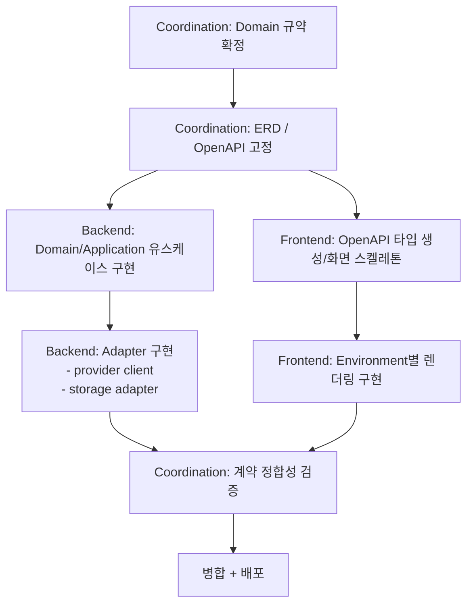
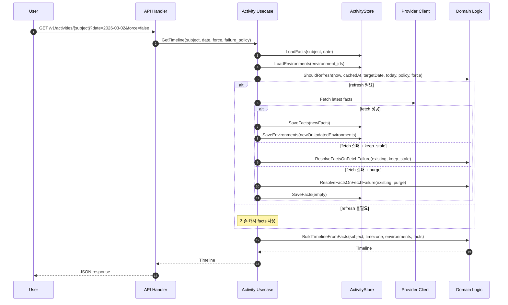
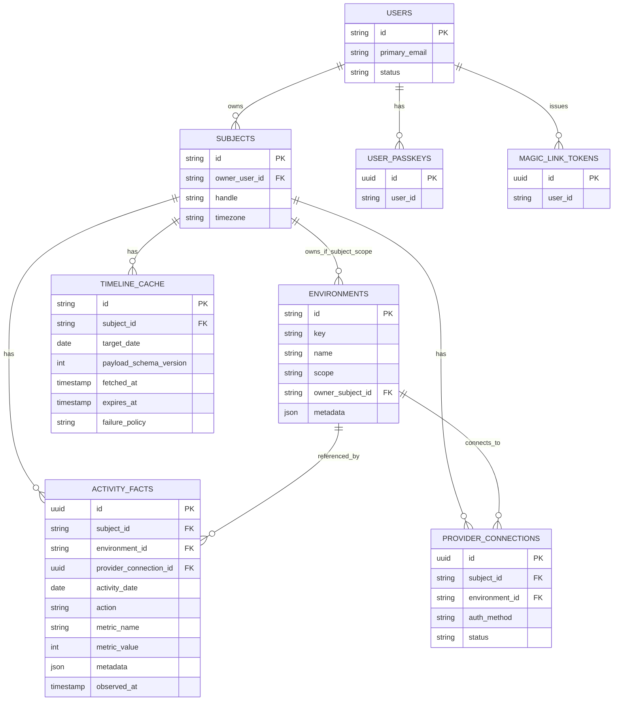

# 구현 블루프린트 (Multi-agent + ERD)

최종 갱신일: 2026-08-12

> 역사적 구현 초안입니다. 아래 OpenAPI 단일 계약과 `GET /v1/activities/{subject}` 시퀀스는
> 2026-09-22 플랫폼 현대화에서 대체됐으며 현재 실행 지침이 아닙니다. 현행 도메인 계약은
> [`graphql/schema/`](../graphql/schema/)의 SDL, HTTP edge 계약은
> [`openapi/jandibat.yaml`](../openapi/jandibat.yaml)을 참조하세요. 진행 상태는
> [`MODERNIZATION_BACKLOG.ko.md`](MODERNIZATION_BACKLOG.ko.md)를 따릅니다.

## 1) 멀티에이전트 구현 순서도

## 2) 요청 처리 시퀀스 (캐시/강제갱신/실패정책)

## 3) 개념 ERD

상세 버전(개념 + 물리 초안)은 `docs/ERD_CONCEPTUAL_AND_PHYSICAL.ko.md`를 기준으로 봅니다.

## 4) 에이전트별 산출물 경계

- Coordination Agent
  - `docs/**`, `openapi/**`, CI, 인터페이스 변경 로그
- Backend Agent
  - `apps/api/internal/domain/**`
  - `apps/api/internal/application/**`
  - `apps/api/internal/adapters/**`
- Frontend Agent
  - `apps/web/**`, `packages/contracts/**`

## 5) 구현 우선순위

1. Domain/ERD/OpenAPI 고정
2. Backend: `GetTimeline` 유스케이스(도메인 순수 로직 + 포트 조합)
3. Frontend: environment-aware timeline 렌더링
4. Adapter(Storage/Provider) 연결
5. 계약/회귀 테스트 자동화
